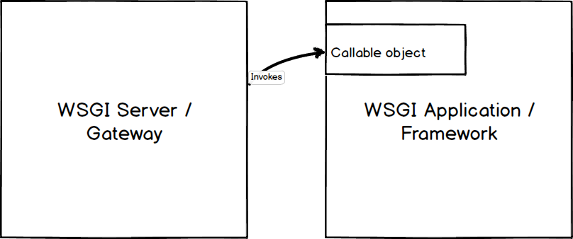

Theresa (Machine Learning Webservice) <sup>![Python Version Badge][Python Version Badge]</sup>
==============================================================================================

**The principle of Theresa is one thing: SIMPLE**. Theresa is deployed as a
[separation-of-concern](https://stackoverflow.com/a/59492509) microservice. It does not handle caching, auth, or
request pre-processing or response post-processing. **It simply loads some ML model, performs inference, and returns
prediction over HTTP to Java-based WS layer**.

Entity Extraction
-----------------

### Completion API

The whole story began when I was searching for materials of Nexus Graph logo and saw 
[GraphGPT](https://www.youtube.com/watch?v=mYCIRcobukI&t=1s) ([GitHub](https://github.com/varunshenoy/GraphGPT)), which
open up my journey to OpenAI. GraphGPT used completion endpoint.

- The **completions** endpoint is the core of OpenAI's API. You input some text as a prompt, and the API will return a
  text completion that attempts to match whatever instructions or context you gave it. **Designing our prompt is
  essentially how we "program" the model**.
- Adding examples to your prompt can help communicate patterns or nuances
- completions settings

  - **temperature** is a value between 0 and 1 from the most deterministic result to the most
    per-request-different result

- The models process text by breaking it down into smaller units called tokens
- **Pricing is pay-as-you-go per 1,000 tokens**


Development
-----------

### 1. Create a virtualenv and Activate It

```bash
python3 -m venv .venv
. .venv/bin/activate
```

Or on Windows cmd::

```bash
py -3 -m venv .venv
.venv\Scripts\activate.bat
```

### 2. Install Dependencies

```bash
python3 -m pip install .
```

### 3. Run Webservice Locally

```bash
export APP_CONFIG_FILE=/ABSOLUTE/path/to/settings.cfg
flask --app theresa run --debug
```

- Note that `APP_CONFIG_FILE` has to be an _absolute_ path. It has

  - [X_RAPIDAPI_KEY_MICROSOFT_ENTITY_EXTRACTION](https://rapidapi.com/microsoft-azure-org-microsoft-cognitive-services/api/microsoft-text-analytics1/)

- Running locally has [debug mode][Flas debug mode] turned on
- Swagger API (using [Flasgger][Flasgger]) is available at http://localhost:5000/apidocs/
- The endpoints are available at http://127.0.0.1:5000 Example browser query:

  ```bash
  http://localhost:5000/entityExtraction?sentence="Apple is looking at buying U.K. startup for $1 billion"
  ```

### 4. Test

```bash
pip3 install '.[test]'
export APP_CONFIG_FILE=./tests/settings.test.cfg
pytest
```

Run with coverage report:

```bash
coverage run -m pytest
coverage report
coverage html  # open htmlcov/index.html in a browser
```

CI/CD
-----

- Uses [HashiCorp Packer + Terraform](./hashicorp) which also automates SSL config
- Before CI/CD, we still need to **manually cleanup old EC2 instance**

This is a private repo on GitHub, which offers only 2000 min GitHub Action minutes. Within the 2000-min quota,
[CI/CD through GitHub Action](.github/workflows/ci-cd.yml) can be used. The quota resets every month and current-month
usage can be viewed at https://github.com/settings/billing

### Production Deployment

After developing Theresa, we'll want to make it available publicly to other users. The built-in development server,
debugger, and reloader we use for local development should not be used in production. Instead, we use a dedicated
[WSGI server](#wsgi-servers)

<details>
<summary>WSGI Servers</summary>

A [Web Server Gateway Interface][WSGI] (WSGI) server implements the web server side of the WSGI interface for running
Python web applications.

#### Why is WSGI necessary?

A traditional web server does not understand or have any way to run Python applications. In the late 1990s, a developer
named Grisha Trubetskoy
[came up with an Apache module called mod_python](http://grisha.org/blog/2013/10/25/mod-python-the-long-story/) to
execute arbitrary Python code. For several years in the late 1990s and early 2000s, Apache configured with mod_python
ran most Python web applications.

However, mod_python wasn't a standard specification. It was just an implementation that allowed Python code to run on a
server. As mod_python's development stalled and security vulnerabilities were discovered there was recognition by the
community that a consistent way to execute Python code for web applications was needed.

Therefore the Python community came up with WSGI as a standard interface that modules and containers could implement.
WSGI is now the accepted approach for running Python web applications.



As shown in the above diagram, a WSGI server simply invokes a callable object on the WSGI application as defined by the
[PEP 3333][PEP 3333] standard.

</details>


[Flas debug mode]: https://flask.palletsprojects.com/en/latest/quickstart/#debug-mode
[Flasgger]: https://github.com/flasgger/flasgger

[PEP 3333]: https://qubitpi.github.io/peps/pep-3333.html
[Python Version Badge]: https://img.shields.io/badge/Python-3.10-brightgreen?style=flat-square&logo=python&logoColor=white

[WSGI]: https://www.fullstackpython.com/wsgi-servers.html
