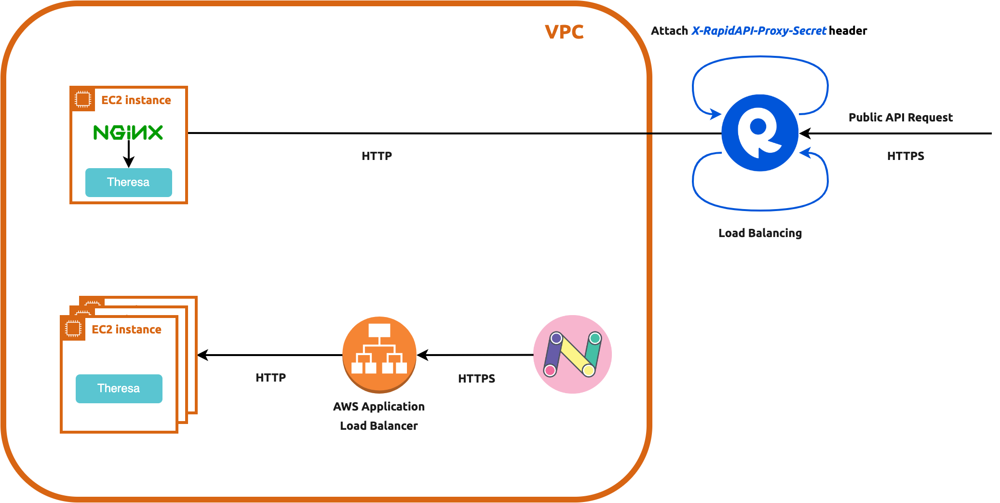

Theresa <sup></sup>
=======

- Since this is a private-repo by a single person, documentations are all in this pge
- **The principle of Theresa is **SIMPLE, SIMPLE, and SIMPLE**. Theresa is a machine learning service deployed as a
  [separation-of-concern](https://stackoverflow.com/a/59492509) microservice. It does NOT handle caching, auth, or
  request pre-processing or response post-processing. **It simply loads some ML model, performs inference, and returns
  prediction**.


Development
-----------

### 1. Creating a virtualenv and Activate It

```bash
python3 -m venv .venv
. .venv/bin/activate
```

### 2. Installing Dependencies

```bash
python3 -m pip install .
```

### 3. Run Webservice Locally in Dev Mode

```bash
export APP_CONFIG_FILE=/ABSOLUTE/path/to/settings.cfg # or source ~/.bashrc
flask --app theresa run --debug
```

- Note that `APP_CONFIG_FILE` has to be an _absolute_ path.
- Running locally has [Flask debug mode](https://flask.palletsprojects.com/en/latest/quickstart/#debug-mode) turned on
- Swagger API (using [Flasgger](https://github.com/flasgger/flasgger)) is available at http://localhost:5000/apidocs/
- The endpoints are available at http://127.0.0.1:5000. Example browser query:

  ```bash
  curl --request POST \
    --url 'http://localhost:5000' \
    --header 'content-type: application/json' --data '{
      "text": [
        "米哈游成立于2011年,致力于为用户提供美好的、超出预期的产品与内容。米哈游多年来秉持技术自主创新,坚持走原创精品之路,围绕原创IP打造了涵盖漫画、动画、游戏、音乐、小说及动漫周边的全产业链。"
      ]
    }'
  ```

### 4. Test

```bash
pip3 install '.[test]'
export APP_CONFIG_FILE=./tests/settings.test.cfg # or source ~/.bashrc
pytest
```

Run with coverage report:

```bash
coverage run -m pytest
coverage report
coverage html  # open htmlcov/index.html in a browser
```

CI/CD
-----



- [Diagram source code](./docs/deployment.drawio)
- This is a private repo on GitHub, which offers only 2000 min GitHub Action minutes. Within the 2000-min quota,
  [CI/CD through GitHub Action](.github/workflows/ci-cd.yml) can be used. The quota resets every month and current-month
  usage can be viewed at https://github.com/settings/billing
- To protect API from unauthorized use:

  - Rapid API instance uses Nginx to check
    [Rapid API gateway header](https://docs.rapidapi.com/docs/security-threat-protection#firewall-settings) so that only
    Rapid API requests can hit public instance
  - Although there is no check between EC2 and its load balancer, the load balancer binds to a Security Group called
    "Paion Data nexusgraph Theresa Load Balancer" whose inbound rules only allows requests from app.nexusgraph.com EC2
    instances

- After [CI/CD](./.github/workflows/ci-cd.yml) completes, we still need to

  - Manually bind EC2 instances to nexusgraph LB target groups and delete old instances
  - Manually update Base URL on RapidAPI

### Running in Production

After developing Theresa, we'll want to make it available publicly to other users. The built-in development server,
debugger, and reloader we use for local development should not be used in production. Instead, we use a dedicated
[WSGI server](#wsgi-servers) listening at port **8000**

Entity Extraction
-----------------

### Completion API

The whole story began when, while I was searching for materials of Nexus Graph logo on Google Image, saw an image that
links to this [GraphGPT on YouTube](https://www.youtube.com/watch?v=mYCIRcobukI&t=1s)
([GitHub](https://github.com/varunshenoy/GraphGPT)). GraphGPT opened up my journey to OpenAI. Later I learnGraphGPT used
completion endpoint.

- The **completions** endpoint is the core of OpenAI's API. We input some text as a prompt, and the API will return a
  text completion that attempts to match whatever instructions or context you gave it. **Designing our prompt is
  essentially how we "program" the model**.
- Adding examples to our prompt can help communicate patterns or nuances
- completions settings

  - **temperature** is a value between 0 and 1 from the most deterministic result to the most
    per-request-different result

- The models process text by breaking it down into smaller units called tokens
- **Pricing is pay-as-you-go per 1,000 tokens**

**The GraphGTP-based entity extraction is in [graph_gpt.py](./theresa/entity_extraction/graph_gpt.py) module**, but
_OpenAI is not free and is not very cheap_, so I decided to develop an _alternative OpenAI_ from scratch

### Tokenization + PoC

This approach uses open source tools to

1. tokenize text to generate graph nodes, and
2. link nodes using verbs via Part of Speech tagging

[This link](https://github.com/howl-anderson/Chinese_tokenizer_benchmark)

... experiment result is not very good:

> 米哈|游|成立|于|2011|年|,|致力于|为|用户|提供|美好|的|、|超出|预期|的|产品|与|内容|。`
> |米哈|游|多年|来|秉持|技术|自主|创新|,|坚持|走|原创|精品|之|路|,|围绕|原创|IP|打造|了|涵盖|漫画|、`
> |动画|、|游戏|、|音乐|、|小说|及|动漫|周边|的|全|产业链|。

conclusion: this is a very good candidate for innovation

### HanLP

I turned and thought if recognizing a simple noun like "米哈游" is hard, why not just load a giant Chinese phrase
corpus into a database and develop some algorithm to greedy search against it? Well, maybe it's computationally 
expensive but simply searching for some interesting data like phrase corpus appeared to be interestingly enough for me.

So I googled "汉语单词数据库" and stumbled upon
[this link](https://www.hankcs.com/nlp/corpus/tens-of-millions-of-giant-chinese-word-library-share.html), which took
me to this super unicorn tool - [HanLP](https://github.com/QubitPi/HanLP)

I also noticed HanLP is also using 3rd party tools like `https://nlp.stanford.edu/software/stanford-parser-full-2013-11-12.zip`
found in doc build log. So a lesson would be to **combine multiple great tools organically to build powerful knowledge
graph generator from text**, which leads me to the next approach

## Multi/Multiplex Parser

MLflow
------

### Entity Extraction

Follow [Development section](#development) to create virtual environment and run

```bash
pip3 install -r requirements.txt
```

```bash
cd mlflow_models/HanLPner
python3 HanLPner.py
```

A model directory called "HanLPner" appears under `mlflow_models/models`. Then build Docker image and run container with

```bash
cd mlflow_models/models/HanLPner
mlflow models build-docker --name "entity-extraction"

docker run --rm \
  --memory=4000m \
  -p 5001:8080 \
  -v /abs/path/to/models/HanLPner:/opt/ml/model \
  -e GUNICORN_CMD_ARGS="--timeout 60 -k gevent --workers=1" \
  "entity-extraction"
```

> ⚠️⚠️⚠️
> 
> The number of worker process MUST be **1** (`--workers=1`) to prevent multiple workers from downloading a HanLP
> pre-trained model to the same location, which results in runtime error in Docker container. In **native** environment,
> this error can be
> 
> ```bash
> OSError: [Errno 39] Directory not empty: '/root/.hanlp/mtl/close_tok_pos_ner_srl_dep_sdp_con_electra_small_20210304_135840'
> -> '/root/.hanlp/mtl/close_tok_pos_ner_srl_dep_sdp_con_electra_small_20210111_124159'
> ```
> 
> ⚠️⚠️⚠️
Example query:

```bash
curl -X POST -H "Content-Type:application/json; format=pandas-split" \
  --data '{"columns":["text"],"index":[0],"data":[["米哈游成立于2011年,致力于为用户提供美好的、超出预期的产品与内容。米哈游多年来秉持技术自主创新,坚持走原创精品之路,围绕原创IP打造了涵盖漫画、动画、游戏、音乐、小说及动漫周边的全产业链。"]]}' \
  http://127.0.0.1:5001/invocations
```
