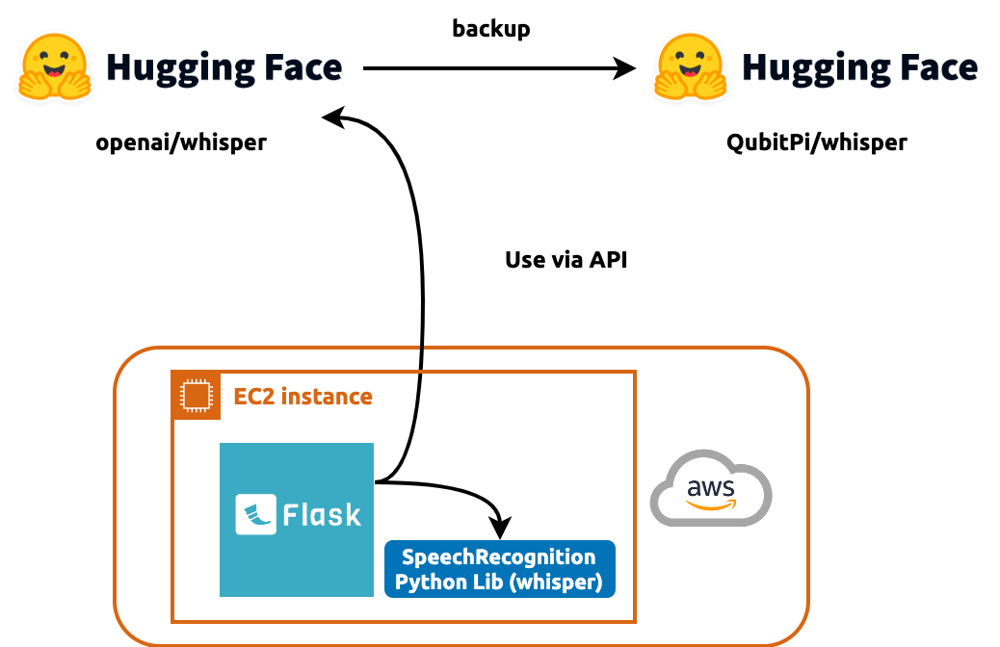

Speech Recognition REST API via Python Flask Webservice (No Model)
==================================================================



Two "models" are offered in this API

1. [openai/whisper](https://huggingface.co/spaces/openai/whisper)

   - This is an un-fine tuned official model
   - [QubitPi backup](https://huggingface.co/spaces/QubitPi/whisper)

2. [SpeechRecognition Python Library (Whisper recognizer)](https://github.com/QubitPi/speech_recognition)

Development
-----------

- Swagger can only be accessed by me

### Setup

```console
cd flask_ws/speechrecognition
python3 -m venv .venv
. .venv/bin/activate
pip3 install -r requirements.txt
```

### Start Prod Server

```console
touch theresa.log
gunicorn \
  -w 4 \
  -b 0.0.0.0 \
  --timeout 600 \
  --limit-request-line 0 \
  --log-file theresa.log \
  --log-level DEBUG \
  'asr:create_app()'
```

### Example Request - Transcribing Audio

> [!TIP]
>
> This curl was generated from Postman. It's very helpful to
> [make it work on Postman](https://galaxyofai.com/how-to-send-audio-files-to-flask-api-using-postman/) and have it
> generate curl for us

```console
curl --location 'localhost:8000/whisperHuggingFaceSpace' --form 'audio=@"/abs/path/to/test.wav"'
```

```console
curl --location 'localhost:8000/speechrecognitionLibrary' --form 'audio=@"/abs/path/to/test.wav"'
```

Deployment (Manual)
-------------------

> [!WARNING]
> 
> - The accumulating logs will eventually fill up disk space on EC2!
> - If this Flask service is behind a proxy like Nginx, we must put a `custom.conf` under
>   __/etc/nginx/conf.d/custom.conf__ to
> 
>   1. [Allow longer transcription time](https://stackoverflow.com/a/54605177)
>   2. Allow big upload audio file
>
>   ```
>   # All custom configs are in this file
>   # https://stackoverflow.com/a/54605177
>   # https://docs.nginx.com/nginx/admin-guide/basic-functionality/managing-configuration-files/
>   
>   client_max_body_size 100000M;
>   
>   proxy_connect_timeout 6000;
>   proxy_send_timeout 6000;
>   proxy_read_timeout 6000;
>   send_timeout 6000;
>   ```

[Set AWS credentials first](https://developer.hashicorp.com/terraform/tutorials/aws-get-started/aws-build)
(paion-data-ami-and-ec2-manager). This is already done in `~/.bashrc`. Simply make sure `source ~/.bashrc` is done

```console
cd flask_ws/hashicorp/images/speechrecognition
packer init .
packer validate .
packer build .

cd ../../instances/speechrecognition/
terraform init
terraform validate
terraform apply -auto-approve
```

> [!TIP]
>
> Healthcheck: http://18.144.28.224:8000/healthcheck
> API Docs: http://18.144.28.224:8000/apidocs/

### Service Discovery

Manually register service:

```bash
export THERESA_EC2_PRIVATE_IP=172.31.7.136
export KONG_GATEWAY_DOMAIN=gateway.theresa-api.com
export SERVICE_NAME=speechrecognition-model1
export ROUTE_NAME=speechrecognition-model1

curl -i -s -k -X POST https://${KONG_GATEWAY_DOMAIN}:8444/services \
  --data name=${SERVICE_NAME} \
  --data url="http://${THERESA_EC2_PRIVATE_IP}:8000/whisperHuggingFaceSpace"

curl -i -k -X POST https://${KONG_GATEWAY_DOMAIN}:8444/services/${SERVICE_NAME}/routes \
  --data "paths[]=/${ROUTE_NAME}" \
  --data name=${ROUTE_NAME}
```

We should see `HTTP/1.1 201 Created` as a sign of success. Then we can test routing with

```console
curl -k -X POST \
  --form 'audio=@"/Users/jackjack/Desktop/test-audio.wav"' \
  https://${KONG_GATEWAY_DOMAIN}/${ROUTE_NAME}
```

### Nginx (If SSL is needed)

```
server {
    listen 80 default_server;
    listen [::]:80 default_server;

    root /var/www/html;

    index index.html index.htm index.nginx-debian.html;

    server_name _;

    location / {
        try_files $uri $uri/ =404;
    }
}

server {
    root /var/www/html;

    index index.html index.htm index.nginx-debian.html;
    server_name asr-test.paion-data.dev;

    location / {
        proxy_pass http://localhost:8000;
    }

    location /apidocs {
        proxy_pass http://localhost:8000/apidocs;
        allow 13.57.13.209;
        allow 54.153.21.51;
        deny all;
    }

    listen [::]:443 ssl ipv6only=on;
    listen 443 ssl;
    ssl_certificate /etc/ssl/certs/server.crt;
    ssl_certificate_key /etc/ssl/private/server.key;
}
server {
    if ($host = asr-test.paion-data.dev) {
        return 301 https://$host$request_uri;
    }

    listen 80 ;
    listen [::]:80 ;
    server_name asr-test.paion-data.dev;
    return 404;
}
```
