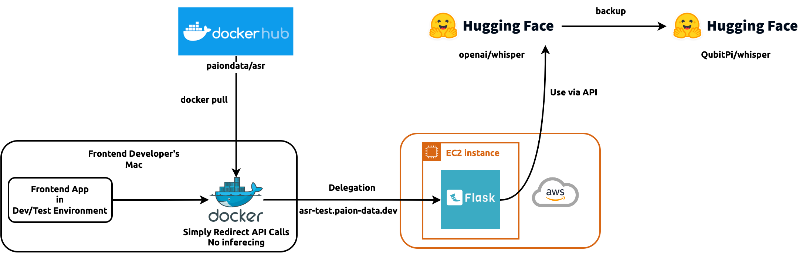

ASR REST API for [Frontend Dev](https://github.com/paion-data/dental-llm-web-app) & Testing
===========================================================================================



- [openai/whisper](https://huggingface.co/spaces/openai/whisper)

  - This is an un-fine tuned official model
  - [QubitPi backup](https://huggingface.co/spaces/QubitPi/whisper)

- The reason is to completely hide confidential technology and offers a consistent API layer 

#### Development

##### Setup

```console
cd test_models
python3 -m venv .venv
. .venv/bin/activate
pip3 install -r asr/requirements.txt
```

##### Start Prod Server

```console
gunicorn \
  -w 4 \
  -b 0.0.0.0 \
  --timeout 600 \
  --limit-request-line 0 \
  --log-file asr/theresa.log \
  --log-level DEBUG \
  'asr:create_app()'
```

##### Example Request - Transcribing Audio

> [!TIP]
>
> This curl was generated from Postman. It's very helpful to
> [make it work on Postman](https://galaxyofai.com/how-to-send-audio-files-to-flask-api-using-postman/) and have it
> generate curl for us

```console
curl --location 'localhost:8000/asr' \
--form 'audio=@"/abs/path/to/test.mp3"'
```

#### Deployment (Manual)

> [!WARNING]
> 
> The accumulating logs will eventually fill up disk space on EC2!

> [!TIP]
>
> Deployment logics are [Packer](../../hashicorp/images/asr-test) & [Terraform](../../hashicorp/instances/asr-test)

~~[Set AWS credentials first](https://developer.hashicorp.com/terraform/tutorials/aws-get-started/aws-build)
(paion-data-ami-and-ec2-manager). This is already done in `~/.bashrc`~~

```console
cd theresa/hashicorp/images/asr-test
packer init .
packer validate .
packer build .

cd ../../instances/asr-test/
terraform init
terraform validate
terraform apply -auto-approve
```

> [!TIP]
>
> Healthcheck: https://asr-test.paion-data.dev/healthcheck
> Example inferencing:
> 
> ```console
> curl --location 'https://asr-test.paion-data.dev/asr' --form 'audio=@"/abs/path/to/test.mp3"'
> ```
